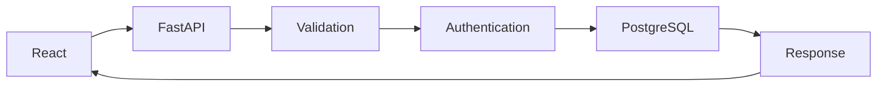

# 🍔 Dailyfoods


<p align="center">
  
  
  
  
  
</p>

---

# 📖 About

Dailyfoods is a full-stack food delivery application inspired by iFood.

The project was developed to practice modern web development concepts using **React**, **FastAPI**, and **PostgreSQL**, focusing on authentication, restaurant management, order visualization and responsive UI.

---


# ✨ Features

- ✅ User Authentication
- ✅ Restaurant Registration
- ✅ Dynamic Menu
- ✅ Image Upload
- ✅ Order Management
- ✅ Comments
- ✅ Responsive Design
- ✅ Cookie Authentication
- ✅ PostgreSQL Database

---

# 🏗 Architecture

```
                React
                  │
                  ▼
             FastAPI API
                  │
                  ▼
            PostgreSQL Database
```

---

# 🛠 Technologies & Tools

<div align="center">


</div>

---

# 📂 Project Structure

```
Dailyfoods
│
├── API
│   ├── Database
│   ├── Prompts
│   ├── Routers
│   ├── Validation
│   └── main.py
│
├── src
│   ├── Components
│   ├── StylesGlobals
│   ├── Assets
│
├── Uploads
└── README.md
```

---

# 🚀 Getting Started

## Clone

```bash
git clone https://github.com/SEU-USUARIO/Dailyfoods.git
```

## Backend

```bash
cd API

python -m venv .venv

pip install -r requirements.txt

uvicorn main:app --reload
```

## Frontend

```bash
npm install

npm run dev
```

---

#

# 🔄 Application Flow



---

# 🎯 Learning Objectives

- REST APIs
- Authentication
- React Context
- File Upload
- PostgreSQL
- Responsive UI
- Component Architecture

---

## 📊 Dailyfoods — Tecnologias


pie title Dailyfoods - Tecnologias
    "React" : 35
    "Python / FastAPI" : 35
    "PostgreSQL" : 20
    "JavaScript / CSS" : 10

---


# 👨‍💻 Author

João Pedro 